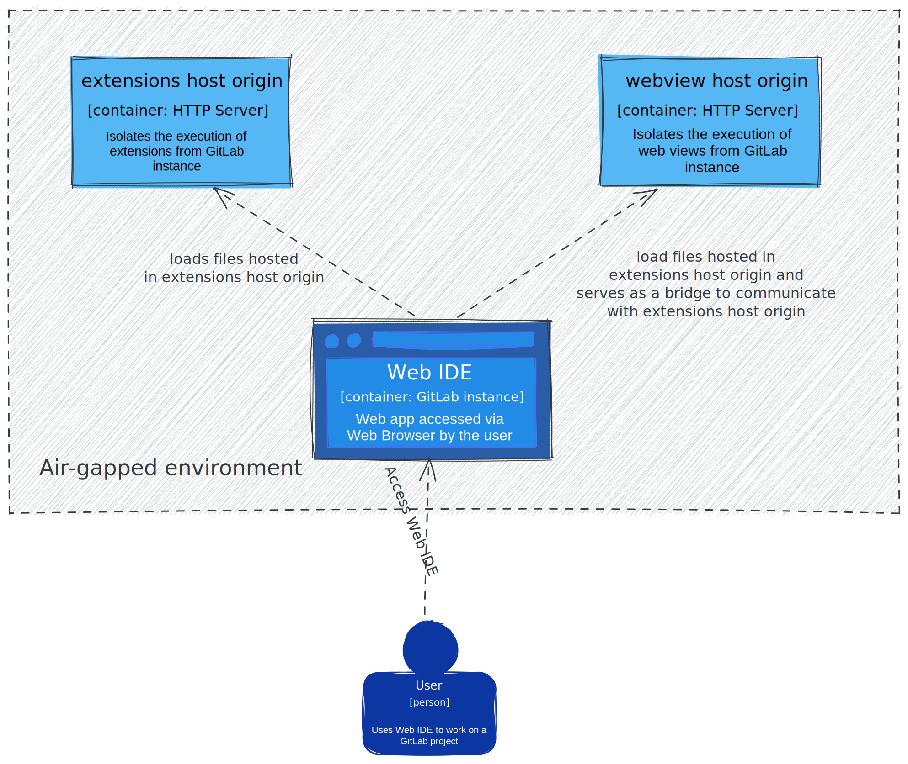

# Web IDE deployment

This document describes the deployment architecture of the
Web IDE.

Users can execute 3rd-party code in the Web IDE by installing extensions, and extensions can also
load Web Views that are small web aplications embedded as iframes. For security reasons, the Web IDE executes extensions and Web Views in [separate origins](https://developer.mozilla.org/en-US/docs/Web/Security/Same-origin_policy) to restrict them from getting access to the GitLab's user data.

We call "extensions host" and "web view host" to the small web applications that run extensions and
web views on a separate origin.

## Deploying the Web IDE on air-gapped environments

The Web IDE assumes that the extensions host and the web view host are deployed in an HTTP server
that is reachable using the domain `https://{{uuid}}.cdn.web-ide.gitlab-static.net`. GitLab, the company,
deploys these web applications in a CDN that is reachable by GitLab self-managed instances unless
their environment is **offline or air-gapped**.

In an air-gapped environment, follow these instructions to deploy the extensions host and the web view host:

### Obtain the extensions host and web view host files

1. Identify the Web IDE version used by the GitLab instance.
   1. Identify which GitLab version your instance is running, for example: 17.2.4.
   1. In the [`gitlab-org/gitlab` project](https://gitlab.com/gitlab-org/gitlab), use the repository view
      to select the tag that points to the target GitLab version, for example: `17.2.4-ee`.
   1. Open the `package.json` file located in the root directory and look for the `"@gitlab/web-ide"` dependency.
   1. Copy the GitLab Web IDE version assigned to this package.
   1. For example, for GitLab 17.2.4-ee, the Web IDE version is
      [`"0.0.1-dev-20240613133550"`](https://gitlab.com/gitlab-org/gitlab/-/blob/v17.2.4-ee/package.json?ref_type=tags#L71).
1. Download the GitLab VSCode Fork artifact used by the Web IDE.
   1. Use the repository view in GitLab to open the files in the Web IDE version tag created in the [`gitlab-org/gitlab-web-ide` project](https://gitlab.com/gitlab-org/gitlab-web-ide).
      For example, for version `0.0.1-dev-20240613133550`, visit the URL `https://gitlab.com/gitlab-org/gitlab-web-ide/-/tree/0.0.1-dev-20240613133550?ref_type=tags`.
   1. Open the JSON file `packages/vscode-build/vscode_version.json` and keep the values of the `commit` and `location` fields at hand. We will use the `commit` field in the next section.
   1. Use the URL from the `location` field to download the GitLab VSCode Fork artifact used by the Web IDE. For example, for version `0.0.1-dev-20240613133550`, the
      artifact URL is `https://gitlab.com/gitlab-org/gitlab-web-ide-vscode-fork/-/package_files/132767208/download`.
   1. Download the GitLab VSCode Fork artifact and extract the files.
   1. You need to deploy the `out` directory and all of it's contents.

The `out` directory contains JavaScript, HTML, and other static assets.
We recommend deploying these files to a CDN to take advantage its caching characteristics.

### Configure extensions host and web view host URL

The Web IDE will send HTTP requests to a URL with the following shape to obtain the extension host and web view host assets:

`https://{{uuid}}.cdn.web-ide.gitlab-static.net/web-ide-vscode/stable/{{commit}}/{{path-to-file}}`

1. `{{uuid}}` is an arbitrary 52-length alphanumeric string generated by the Web IDE. For the web view host, this string changes
   _for every request_. For the extensions host, this string is prefixed with `v--`. For example:
   - `v--010ic6c1s7eu4f341on2lf6ugchugm6a5t71eud1ana4c88rfil3` extensions host.
   - `1tgv6hs5jkirnq78lpe62o5k6shf8qiiqo2urruqjl35pigukn2s` for web view host.
     The goal of the wildcard subdomain is executing every web view and extension on a separate origin and achieve full isolation.  
      It's best to just accept **any** value for `{{uuid}}` since VSCode internally might decorate this differently in different contexts.
1. `{{commit}}` is the hash obtained from the `packages/vscode-build/vscode_version.json` file.
1. `{{path-to-file}}` is the path to a file in the `out` directory.

Here's an example URL that the Web IDE could request:

- `https://0d8906buhmfrbg34oh3a8fegruia4a35dnsl82qmflf20u4pje4r.cdn.web-ide.gitlab-static.net/web-ide-vscode/stable/722e5eb72d4eb15e2fe079b273d7a8f8d9e646ca/out/vs/workbench/contrib/webview/browser/pre/index-no-csp.html?id=ebf00014-13b5-4d6a-9256-0ea2ae01b59e&origin=475000db-da84-47dc-af6d-7e48e5bd2aef&swVersion=4&extensionId=vscode.markdown-language-features&platform=browser&vscode-resource-base-authority=vscode-resource.cdn.web-ide.gitlab-static.net&parentOrigin=https%3A%2F%2Fgitlab.com`
